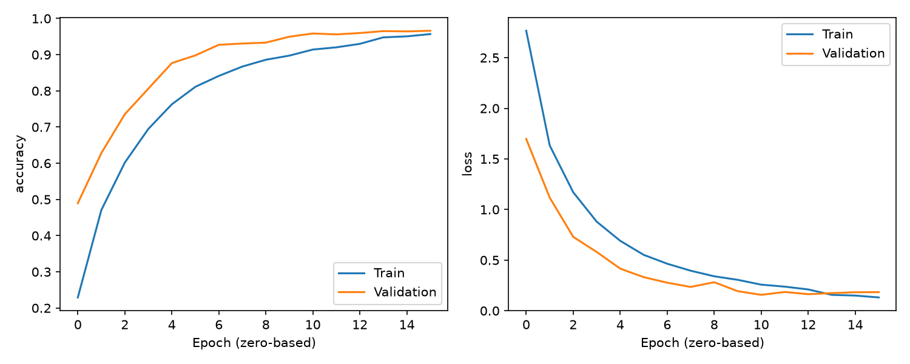
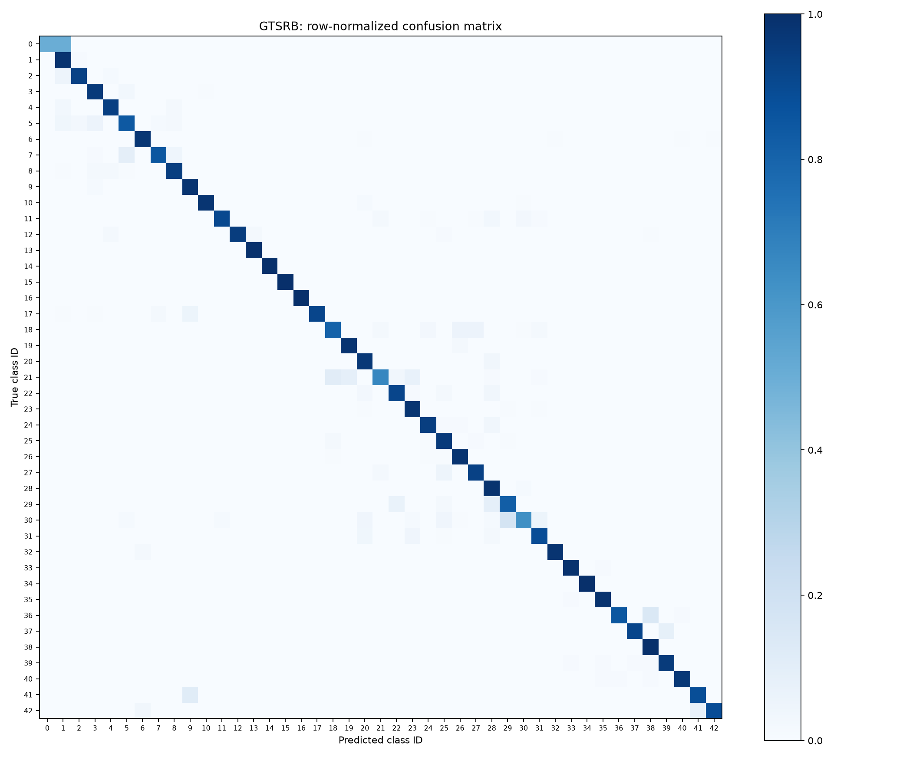
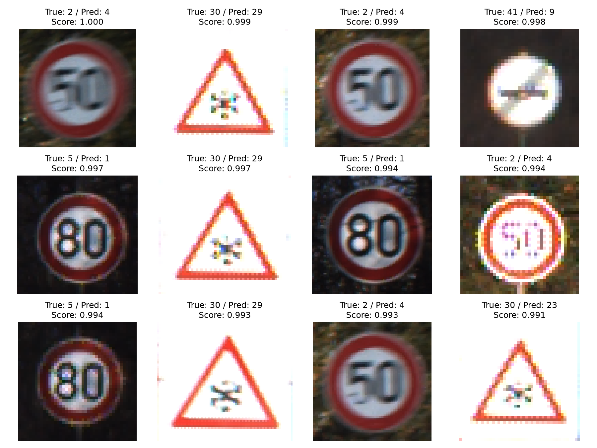

# 실제 실행 결과

실행일: 2026-09-16. 첨부된 Kaggle archive.zip으로 실제 학습과 평가를 수행했습니다.
기존 저장소 기준 커밋: `a8cfddd9c5c3b4677032fac59e3e7bd0ec0a7c5c`.

## 실험 설정

- Python 3.12.14 / TensorFlow 2.20.0 / Windows CPU 실행
- 정확한 패키지 버전: requirements-lock.txt
- Seed 42, batch size 64, 최대 20 epochs, Adam 초기 학습률 0.001
- 학습 31,380장 / 검증 7,829장 / 테스트 12,630장, 전체 43개 클래스
- 학습/검증에 겹치는 track: 0개
- Train.csv 전체에서 클래스별 이미지 수 최솟값 210장, 최댓값 2,250장
- 검증 손실 기준 patience 5로 조기 종료: 실제 16 epochs
- 선택된 체크포인트: 11번째 epoch (CSV의 epoch 값은 0부터 시작)

## 최적 체크포인트 성능

| 지표 | 실측값 |
|---|---:|
| 검증 정확도 | 95.86% |
| 검증 cross-entropy loss | 0.1570 |
| 독립 테스트 정확도 | 93.72% |
| 독립 테스트 macro F1 | 0.9154 |
| 독립 테스트 이미지 수 | 12,630 |

이 값은 한 번의 seed로 실행한 결과이며 여러 실행의 평균이나 신뢰구간이 아닙니다.
테스트셋은 학습·체크포인트 선택에 사용하지 않았습니다. 기존 코드와 동일 조건으로 비교한 실험은 수행하지 않았으므로 기존 대비 향상률은 주장하지 않습니다.



학습에는 증강과 Dropout이 적용되고 검증에는 적용되지 않아 초기 검증 정확도가 학습 정확도보다 높을 수 있습니다. 마지막 epoch의 정확도와 최적 체크포인트의 정확도는 다릅니다. 학습 후반 정확도가 높아져도 검증 손실은 증가할 수 있으므로, 선택 기준을 바꾸지 않고 최저 검증 손실 모델을 평가했습니다.



행은 정답, 열은 예측이며 행별로 정규화했습니다. 원시 건수는 reports/confusion_matrix.csv에 있습니다.

## 테스트 F1이 낮은 5개 클래스

| 클래스 이름 | Precision | Recall | F1 | Support |
|---|---:|---:|---:|---:|
| Speed limit 20 km/h | 1.0000 | 0.5000 | 0.6667 | 60 |
| Beware of ice or snow | 0.8333 | 0.6333 | 0.7197 | 150 |
| Double curve | 0.7895 | 0.6667 | 0.7229 | 90 |
| Bicycles crossing | 0.7115 | 0.8222 | 0.7629 | 90 |
| Pedestrians | 0.6588 | 0.9333 | 0.7724 | 60 |

이 표는 이번 모델의 한계를 분석하기 위한 것입니다. 후속 튜닝은 검증셋을 기준으로 진행하고, 테스트 결과를 반복적인 모델 선택에 사용하지 마세요.



Softmax 점수가 높은 오분류 최대 12개입니다. 높은 점수도 정확성을 보장하지 않습니다. 파일별 정답/예측은 reports/predictions.csv에서 확인할 수 있습니다.

## 검증한 항목

- 단위 테스트 3개 통과: track 누수 방지·RGB 정규화·ZIP 경로 이탈 거부
- 43개 클래스 소량 데이터로 1 epoch 학습 및 저장 모델 재로딩 통과
- 평가 보고서·혼동행렬·오분류 그림 생성 확인
- 전체 학습 및 독립 테스트 평가 완료
- 실제 Test/00000.png 예측: class 16 (정답 16)
- Python 구문 검사, git diff 공백 검사 통과

모델 파일: `runs/cnn/best.keras` (Git 제외, 제공 ZIP에는 포함).
모델 SHA-256: `7c8c89ac6f865d068e4bfe462d0c8a487ea783b43059c7b1768c88dc4ec49957`.

## 재현 명령

```powershell
python -m pip install -r requirements-lock.txt
python src/prepare_data.py /path/to/archive.zip
python src/train.py --epochs 20 --seed 42 --output-dir runs/reproduce
python src/evaluate.py --model runs/reproduce/best.keras --output-dir runs/reproduce/test
```

환경에 따라 소요 시간과 수치가 달라질 수 있습니다. 원본 학습 설정과 분할 경로는 runs/cnn/config.json 및 split.json에 저장되어 있습니다.
