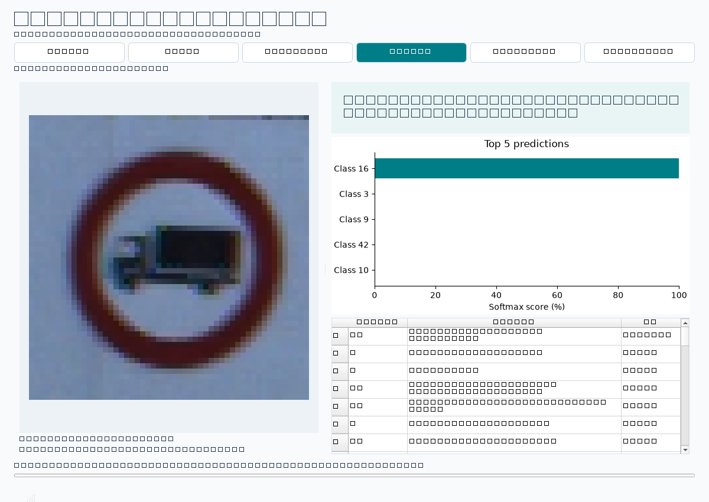

# PySide6 사진 인식 UI

## conda에서 실행

프로젝트 폴더에서 아래 명령을 실행합니다. 환경이 이미 있다면 생성 명령은 생략합니다.

```powershell
conda create -n traffic-sign python=3.12 -y
conda activate traffic-sign
python -m pip install -r requirements-lock.txt
python src/gui.py
```

범위 기반 의존성 설치는 `requirements.txt`로도 가능합니다. 둘 중 하나만 설치하세요. GUI 추가에 따라 두 파일 모두 PySide6와 pandas를 포함하도록 갱신했습니다.

## 사용 순서

1. **사진 업로드**: 잘라낸 교통표지판 사진을 선택합니다.
2. 필요하면 미리보기에서 드래그해 표지판 영역을 직접 선택합니다. **전체 이미지 사용**으로 해제합니다.
3. **표지판 인식**: 선택 영역 또는 전체 이미지를 CNN에 전달합니다.
4. 오른쪽에서 클래스 이름, softmax 점수, Top 5 그래프, 43개 클래스 결과표를 확인합니다.
5. **결과 CSV 저장** / **그래프 PNG 저장**으로 분석 결과를 저장합니다.

기본 모델은 `runs/cnn/best.keras`입니다. 다른 실험 모델은 **모델 선택**으로 불러옵니다. 입력 `(None, 32, 32, 3)` / 출력 `(None, 43)`인 Keras 모델을 사용해야 하며 클래스 순서는 GTSRB ID 0~42입니다. 직접 학습했거나 신뢰하는 모델 파일을 사용하세요.

사진이나 선택 영역, 모델을 바꾸면 이전 결과가 초기화됩니다. 모델 로딩과 추론 중에는 입력 변경을 잠시 막고 진행 표시를 보여줍니다. 처리 중 창 닫기는 완료 후 가능합니다. 첫 추론은 TensorFlow 로딩 때문에 수 초 걸릴 수 있습니다.

## 프로그래밍 로직

| 라이브러리 | 담당 기능 |
|---|---|
| PySide6 | 파일 선택, 사진 미리보기, 드래그 ROI 선택, 결과표, 작업 스레드 |
| Pillow | 이미지 읽기, EXIF 방향 적용, RGB 변환, bilinear 리사이즈 |
| NumPy | float32 변환, 0~1 정규화, 배치 차원 추가 |
| TensorFlow | `.keras` 모델 로딩, CNN 추론, softmax 출력 |
| pandas | 43개 클래스 DataFrame, 점수 정렬, UTF-8 BOM CSV 저장 |
| Matplotlib | Qt 화면 내 Top 5 막대그래프, PNG 저장 |

```text
사진 선택 → RGB 이미지 → 선택 ROI 또는 전체 이미지
→ 32×32 resize → float32 / 255 → shape (1,32,32,3)
→ CNN(training=False) → 43개 점수 → DataFrame 정렬
→ 결과표 + Matplotlib 그래프 + CSV
```

`src/inference.py`는 UI와 분리한 추론 로직입니다. `Predictor`는 모델을 캐시해 같은 모델의 반복 로딩을 줄입니다. `src/gui.py`의 `InferenceWorker`가 QThread에서 추론하고 Signal로 메인 스레드에 결과를 전달합니다. 화면 및 그래프 갱신은 메인 스레드에서 수행합니다.

CSV에는 `image_path`, `class_id`, `class_name`, `score`, `model_path`, `roi`, `exported_at`이 포함됩니다. 점수는 0~1 값입니다. ROI는 EXIF 방향을 적용한 이미지의 픽셀 좌표이며 `(x1,y1,x2,y2)`의 오른쪽/아래 경계는 포함하지 않습니다.

## 범위와 한계

요청한 기능은 **잘라낸 표지판의 종류 인식**입니다. 자동 위치 검출이나 여러 표지판 동시 검출은 구현하지 않습니다. 드래그 영역은 사용자가 직접 지정하는 선택 영역입니다. 모델은 배경/표지판 없음 클래스를 학습하지 않았으므로 일반 사진을 넣어도 43개 클래스 중 하나를 출력합니다. 높은 softmax 점수만으로 정확성을 판단하지 마세요.

## 검증

- 단위 테스트 총 6개 통과: 기존 데이터 파이프라인 + ROI 전처리, 잘못된 모델 출력 거부, CSV 저장/정렬
- 화면을 표시하지 않는 Qt 통합 실행으로 실제 모델의 class 16 예측 확인
- 작업 중 입력 비활성화, 43개 결과표, 이미지 변경 시 결과 초기화, 정상 스레드 종료 확인
- 실제 Qt 위젯 렌더링은 아래 이미지 참고



## 참고 문서

- [Qt for Python: Thread Signals](https://doc.qt.io/qtforpython-6/examples/example_widgets_thread_signals.html)
- [Matplotlib: Embedding in Qt](https://matplotlib.org/3.7.4/gallery/user_interfaces/embedding_in_qt_sgskip.html)
